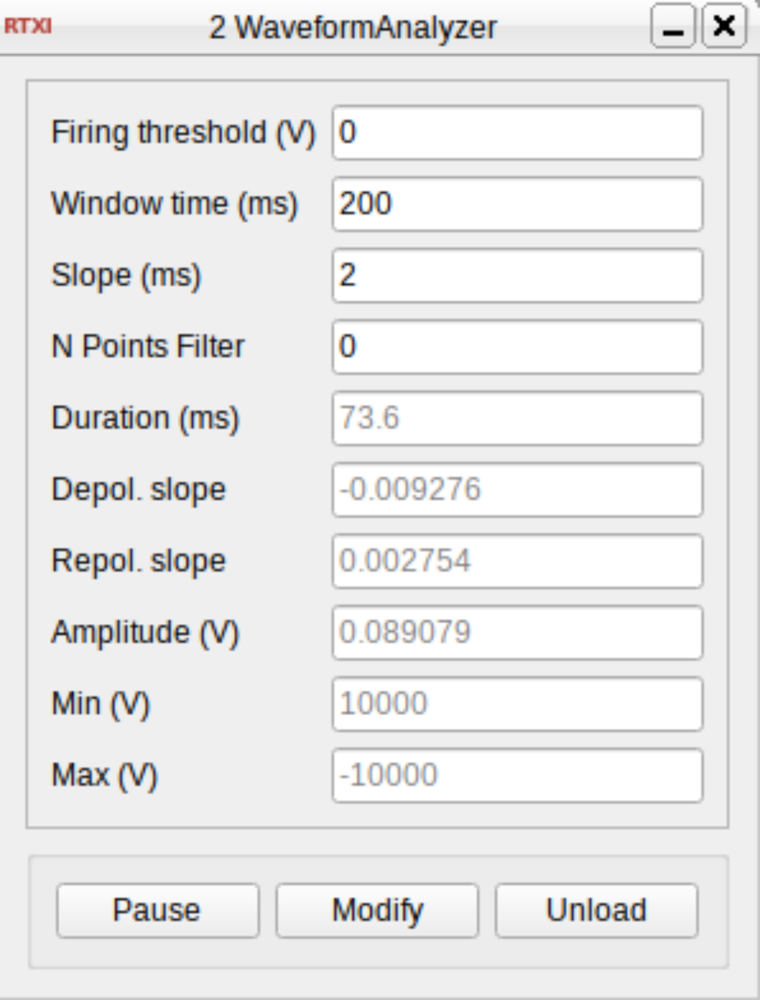

# WaveformAnalyzer

**Author:** Alicia Garrido-Peña  
**Institution:** Grupo de Neurocomputación Biológica, Universidad Autónoma de Madrid  
**License:** GNU General Public License v3.0  
**RTXI Version:** 2.0+  
**Status:** Stable  

---

## Overview

**WaveformAnalyzer** is an RTXI plugin designed for real-time analysis of intracellular neuronal signals. This module detects action potentials ("spikes") and computes key metrics such as **duration**, **amplitude**, and **depolarization/repolarization slopes**. It also includes optional signal filtering and detailed analysis within a configurable time window around each spike.

This plugin is ideal for **online waveform characterization**, **spike detection**, and **event-triggered data processing** in electrophysiological experiments.

---

## Features

- Real-time detection of action potentials from voltage traces.
- Extracts waveform characteristics:
  - Duration (ms)
  - Amplitude (V)
  - Depolarization slope
  - Repolarization slope
  - Min/Max voltages
- Optional signal filtering using a simple weighted moving average.
- Configurable threshold for spike detection.
- Adjustable time window and slope calculation window.

---

## Inputs

| Name           | Description                        |
|----------------|------------------------------------|
| Living neuron  | Voltage signal to analyze (in Volts). |

---

## Parameters

| Name                  | Description                                                  | Type    |
|-----------------------|--------------------------------------------------------------|---------|
| Firing threshold (V)  | Voltage threshold to detect spike onset.                     | Double  |
| Window time (ms)      | Total analysis window around spike peak (in ms).             | Double  |
| Slope (ms)            | Time around midpoints to compute depol/repol slopes.         | Double  |
| N Points Filter       | Number of previous points used in smoothing filter (0 = off).| Integer |

---

## Outputs

| Name                    | Description                                      |
|-------------------------|--------------------------------------------------|
| Filtered signal output  | Filtered version of input signal.                |
| Duration (ms) output    | Total spike duration.                            |
| Depol. slope output     | Depolarization slope near mid-height point.      |
| Repol. slope output     | Repolarization slope near mid-height point.      |
| Amplitude (V) output    | Spike amplitude (max - min voltage).             |
| Analysis after peak     | 1 if in analysis window; 0 otherwise.            |
| Min (V) output          | Minimum voltage detected during window.          |
| Max (V) output          | Maximum voltage detected during window.          |
| Mid point               | Index of mid-point voltage before peak.          |
| Mid point 2             | Index of mid-point voltage after peak.           |

---

## States

These variables store the latest computed values and are useful for logging and monitoring:

| Name           | Description                            |
|----------------|----------------------------------------|
| Duration (ms)  | Last spike's duration in milliseconds. |
| Depol. slope   | Last spike’s depolarization slope.     |
| Repol. slope   | Last spike’s repolarization slope.     |
| Amplitude (V)  | Last spike’s amplitude.                |
| Min (V)        | Minimum voltage in the last spike.     |
| Max (V)        | Maximum voltage in the last spike.     |

---

## Installation

1. Clone the repository or download the source code.
2. Compile using RTXI's plugin build system:
   ```bash
   make
   sudo make install
   ```
3. Launch RTXI and load **WaveformAnalyzer** from the plugin menu.

---

## How It Works

The plugin buffers incoming voltage values and:

- Detects spikes based on a user-defined threshold.
- Captures the waveform around the spike peak.
- Extracts depolarization and repolarization slopes from mid-height voltage points.
- Computes duration as the time between midpoints before and after the peak.
- Outputs the results in real time.

Filtering is optional and configurable via the parameter `N Points Filter`.

